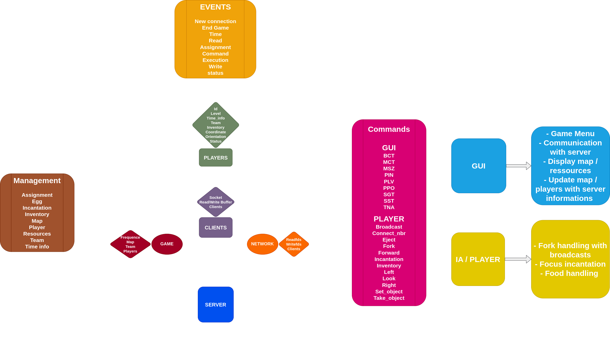
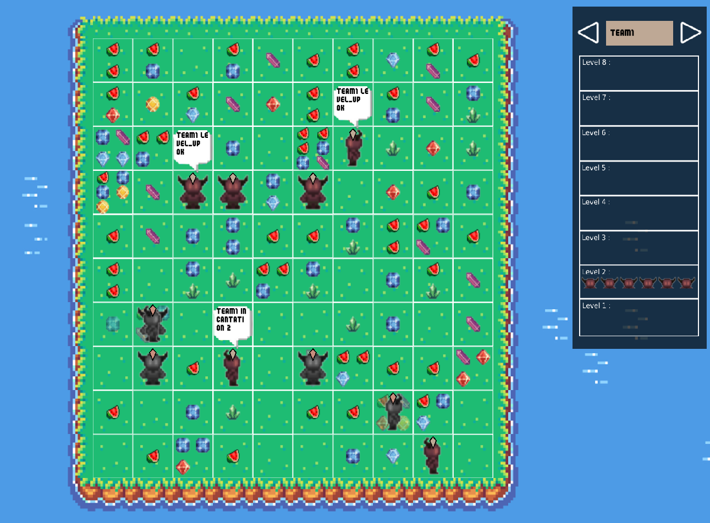

# Zappy ⚔️

Welcome to **Zappy**.

A network game where teams compete on a resource-rich map.

## Language and Tools 🛠️

- **Language:** C, C++, Python
- **Libraries:** SFML
- **Compilation:** Via Makefile, including `re`, `clean`, and `fclean` rules.
- **Binary Names:** `zappy_server`, `zappy_ai`, `zappy_gui`

## Project Overview 🔎

Zappy is a multiplayer game set on the planet Trantor, featuring resource gathering and team-based competition.

Teams aim to elevate their players by performing rituals with gathered resources.

### Diagram 📊

### Game Environment

- **Geography:** A flat world with wrap-around edges.
- **Resources:** Includes food and six types of stones, each with different densities and spawning rules.
- **Activities:** Focus on gathering food and stones for survival and elevation rituals.
- **Elevation Ritual:** A key mechanism where players gather specific stone combinations to level up.
- **Vision and Sound:** Players have limited vision and can hear broadcasts without knowing the source.

### Communication Protocol

Zappy uses a specialized communication protocol between the server and AI clients:

- **Commands:**
  - `msz`: Request or provide map size.
  - `bct`: Request or provide content of a tile.
  - `mct`: Request or provide content of the entire map.
  - `tna`: Request or provide names of all teams.
  - `pnw`: Notify connection of a new player.
  - `ppo`: Request or provide a player's position.
  - `plv`: Request or provide a player's level.
  - `pin`: Request or provide a player's inventory.
  - `pex`: Notify a player's expulsion.
  - `pbc`: Broadcast a message.
  - `pic`: Notify start of an incantation.
  - `pie`: Notify end of an incantation.
  - `pfk`: Notify egg laying by a player.
  - `pdr`: Notify resource dropping.
  - `pgt`: Notify resource collecting.
  - `pdi`: Notify death of a player.
  - `enw`: Notify an egg laid by a player.
  - `eht`: Notify egg hatching.
  - `ebo`: Notify player connection for an egg.
  - `edi`: Notify death of a hatched egg.
  - `sgt`: Request or set time unit.
  - `sst`: Modify time unit.
  - `seg`: Notify end of the game.
  - `smg`: Send a message from the server.
  - `suc`: Indicate an unknown command.
  - `sbp`: Indicate a command parameter.

## Preview 📸

### Binaries

1. **Server (`zappy_server`):** Generates the world and manages game logic.
2. **Graphical Client (`zappy_gui`):** Visualizes the game world.
3. **AI Client (`zappy_ai`):** Controls a player autonomously.

### Installation and Usage 💾

1. **Compile the Project:**
   - Run `make` in the project's root directory.
2. **Running the Server:**
   - Execute `./zappy_server` with appropriate flags.
3. **Connecting Clients:**
   - Launch `zappy_ai` and `zappy_gui` to interact with the game world.

For detailed guidelines and command references, refer to `zappy.pdf` and `zappyProtocole.pdf`.

## License

This project is released under the MIT License. See `LICENSE` for more details.
